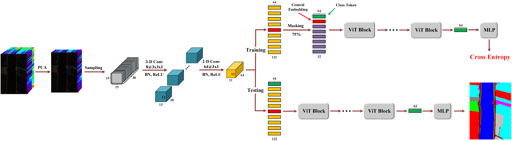
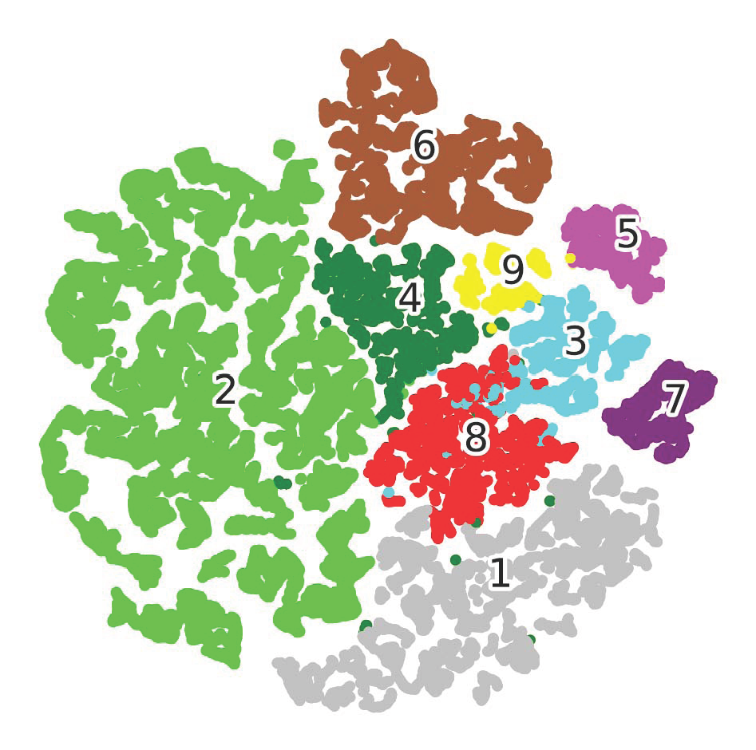

# MViT
Masked Vision Transformer for Fast Hyperspectral Image Classification

Code download link: [MViT code](https://github.com/swiftest/MViT/archive/refs/heads/main.zip).

Here is the bibliography info:
<br/>

```jason
@article{Wang2025Masked,  
  title={Masked Vision Transformer for Fast Hyperspectral Image Classification},  
  author={Wang, Liguo and Wang, Heng and Yin, Shoulin and Wang, Lifeng},  
  journal={IEEE Transactions on Geoscience and Remote Sensing},  
  year={2025},
  volume={63},
  pages={1-16},
  doi={10.1109/TGRS.2025.3572242},
  publisher={IEEE}
}
```

## Steps:
- Place the target data set into the 'dataset' folder.
- Make sure the GPU accelerator is available.
- Run MViT.ipynb in the Jupyter environment (ensure that external modules such as einops and torchsummary are installed).

## Requirements:
timm.__version__ == 0.4.5

## Descriptions

Vision Transformer (ViT) has been thoroughly explored in hyperspectral image (HSI) classification (HIC). Nevertheless, current ViT-based approaches still acquire discriminative features, resulting in relatively limited generalization capabilities when confronted with the challenges posed by high intraclass variances and interclass similarities commonly observed in HSI data. Moreover, most of these methods fail to adequately emphasize the significance of the central pixel in HIC. To address the aforementioned challenges, we introduce a masked ViT (MViT) for HIC. First and foremost, MViT endeavors for the first time to introduce the masking operations in supervised models to learn more robust patterned features instead of distinguishable features, thereby bestowing it with outstanding generalization performance. Secondly, during the training phase of MViT, when conducting the random masking operations on the embedded features, we deliberately retain the embedding corresponding to the central pixel to guarantee the effectiveness of the model and emphasize the importance of the central pixel in HIC. Finally, MViT will deactivate the masking operations during the testing phase and utilize all the embedded features to accomplish the classification task, thereby enabling the model to fully exploit its recognition capabilities. On top of that, MViT is an extremely lightweight model, and by introducing the masking operations during the training phase, its training speed becomes unprecedentedly rapid. Experiments conducted on four publicly accessible datasets demonstrate that MViT can consistently achieve excellent or even the optimal classification results in comparison with the most advanced methods.



Fig1. Overview of the proposed MViT.




Fig13a. 2-D t-SNE visualization of the patterned features learned by MViT from the test samples of the PU dataset.

## Result

### LongKou Dataset

The classification results of MViT on the LongKou dataset using 25 randomly selected training samples per-class are as follows: OA: 97.91±0.63(%), AA: 97.57±0.68(%), Kappa: 0.9727±0.008.

### HanChuan Dataset

The classification results of MViT on the HanChuan dataset using 25 randomly selected training samples per-class are as follows: OA: 91.88±0.53(%), AA: 91.29±0.42(%), Kappa: 0.9054±0.006.

### HongHu Dataset

The classification results of MViT on the HongHu dataset using 25 randomly selected training samples per-class are as follows: OA: 93.65±0.53(%), AA: 94.05±0.36(%), Kappa: 0.9203±0.006.

### Pavia University Dataset

The classification results of MViT on the Pavia University (PU) dataset using 25 randomly selected training samples per-class are as follows: OA: 96.99±0.96(%), AA: 97.07±0.82(%), Kappa: 0.9603±0.013.

## Acknowledgement

The authors would like to thank the Editor, Associate Editor, and anonymous reviewers for their helpful comments and suggestions that improved this article.
